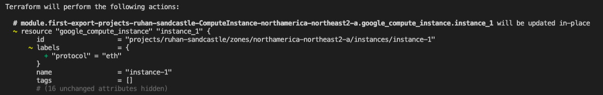
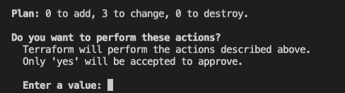
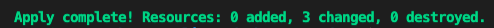
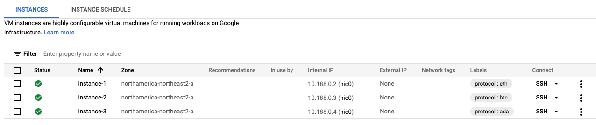
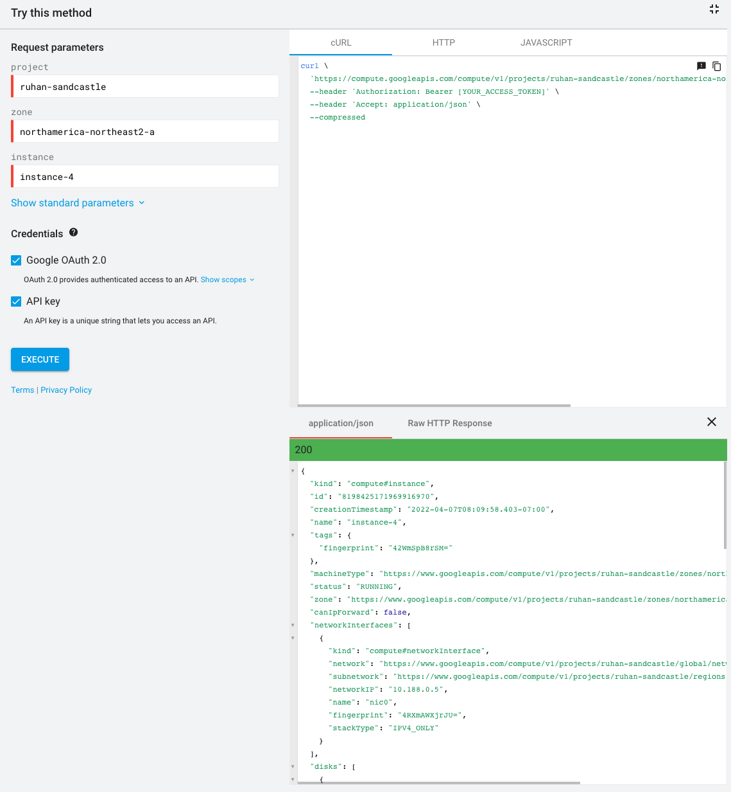
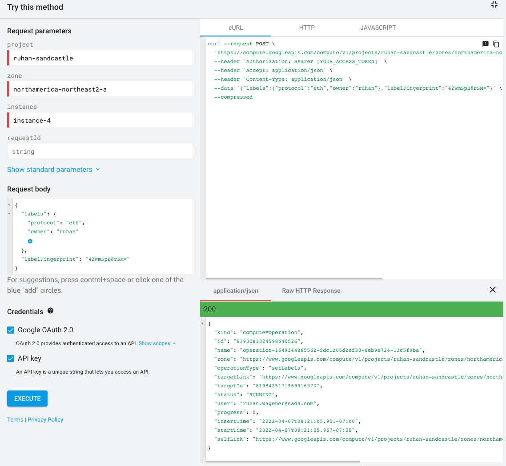
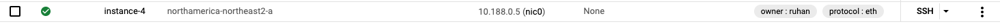

<p align=center vertical-align: middle; padding:20px 0;">
	
</p>

## Label resources using Terraform export/import

Using the ```gcloud config-connector``` CLI, easily export and import project configurations on GCP. This tool can be leveraged to maintain project state using Terraform going forward.

For this particular use case, it can be used to update asset labels in an automated fashion.

1. To start, follow [this guide](https://cloud.google.com/docs/terraform/resource-management/export) to get started on your first project export. This will generate ```.tf``` manifests for all your cloud resources contained within the project you specify. You are able to further configure the scope of your export as well, for example only export specific compute engine assets.
2. From there, you can [import](https://cloud.google.com/docs/terraform/resource-management/import) all assets generated in step 1 into terraform state.
> **Note**
> 
> By performing the import steps, none of your cloud resources are being modified. Relevant terraform commands would still need to be executed to apply your configuration. These steps are also outlined in this document.

3. Update relevant ```.tf``` assets, for example compute engine instances, with your required arguments. For labels, here is an example extract implemented across three instances:

	```js
	resource "google_compute_instance" "instance_1" {
	  boot_disk {
	    auto_delete = true
	    device_name = "instance-1"
	
	    initialize_params {
	      image = "https://www.googleapis.com/compute/beta/projects/debian-cloud/global/images/debian-10-buster-v20220317"
	      size  = 10
	      type  = "pd-balanced"
	    }
	
	    mode   = "READ_WRITE"
	    source = "https://www.googleapis.com/compute/v1/projects/ruhan-sandcastle/zones/northamerica-northeast2-a/disks/instance-1"
	  }
	
	  labels = {
	    "protocol" = "eth"
	  }
	
	  machine_type = "e2-small"
	  name         = "instance-1"
	```
	> instance-1
	
	-
	
	```js
	resource "google_compute_instance" "instance_2" {
	  boot_disk {
	    auto_delete = true
	    device_name = "instance-2"
	
	    initialize_params {
	      image = "https://www.googleapis.com/compute/beta/projects/debian-cloud/global/images/debian-10-buster-v20220317"
	      size  = 10
	      type  = "pd-balanced"
	    }
	
	    mode   = "READ_WRITE"
	    source = "https://www.googleapis.com/compute/v1/projects/ruhan-sandcastle/zones/northamerica-northeast2-a/disks/instance-2"
	  }
	
	  labels = {
	    "protocol" = "btc"
	  }
	
	  machine_type = "e2-small"
	  name         = "instance-2"
	```
	> instance-2
	
	-
	
	```js
	resource "google_compute_instance" "instance_3" {
	  boot_disk {
	    auto_delete = true
	    device_name = "instance-3"
	
	    initialize_params {
	      image = "https://www.googleapis.com/compute/beta/projects/debian-cloud/global/images/debian-10-buster-v20220317"
	      size  = 10
	      type  = "pd-balanced"
	    }
	
	    mode   = "READ_WRITE"
	    source = "https://www.googleapis.com/compute/v1/projects/ruhan-sandcastle/zones/northamerica-northeast2-a/disks/instance-3"
	  }
	
	  labels = {
	    "protocol" = "ada"
	  }
	
	  machine_type = "e2-small"
	  name         = "instance-3"
	```
	
	> instance-3

	-


4. After updating the labels for your instances (and potentially other assets you'd like to label) all that's left to do is apply the configuration to your existing cloud resources by running ```	terraform plan```
	> output of this command should look something like this:
	> 
	> 

5. Finally, run ```terraform apply``` 
	> output of this command should look something like this:
	>
	> 
	> 
	
	Your compute engine output should show the new labels in the console after the apply successfully completes.
	
	
	
## Label resources using Google APIs
For continuity and simplicity, the below section will focus on applying labels via API to compute engine instances. There are a few different approaches to get started:

#### 1. API Explorer
	
- The first step would be to gather metadata about your existing instance(s). Using the API Explorer simplifies this process and also provides code which can be implemented as part of your existing solutions. 
- To ultimately update the label of your instance, you need the following field structure satisfied:

```js
{
"labels": {
string: string,
...
},
"labelFingerprint": string
}
```
> _labelFingerprint_ is the field attribute we need to retrieve first, which can be done as outlined below
	
- Leverage the [instances.get](https://cloud.google.com/compute/docs/reference/rest/v1/instances/get) method. This can be done from the browser to understand the workflow and parameters and automated via code (which is conveniently provided in the API explorer as well). Here is an example:


> Notice how the inline cURL, HTTP and Javascript is generated for you as well. This can be used to integrate with existing solutions or to create scripts for automation in bulk.
	
- From the output generated in the previous step, grab the _labelFingerprint_ value for the instance. This will be used in the next API call where you will apply the desired label(s).
	
```js
"cpuPlatform": "Intel Broadwell",
"labelFingerprint": "42WmSpB8rSM=",
"startRestricted": false,
"deletionProtection": false,
"reservationAffinity": {
"consumeReservationType": "ANY_RESERVATION"
```
	
- Next, use the [instances.setLabels](https://cloud.google.com/compute/docs/reference/rest/v1/instances/setLabels) method to apply the labels to the instance.
	

> After receiving a *200* response, your new labels should reflect within the GCP Console.
	


#### 2. API Client Library

- There are several supported client libraries for the most popular languages like Java, Go, Python, Node.js etc. For this example, leverage the [Go client library](https://cloud.google.com/go/docs/reference) using the [compute api](https://cloud.google.com/go/docs/reference/cloud.google.com/go/latest/compute/apiv1)
- [Example](https://cloud.google.com/compute/docs/reference/rest/v1/instances/setLabels#examples)
- The workflow should be consistent in that you would need to gather the _labelFingerprint_ before applying the labels to your instance. Here are the links to each relevant function in Go:
	- [InstancesClient Get](https://cloud.google.com/go/docs/reference/cloud.google.com/go/compute/latest/apiv1#cloud_google_com_go_compute_apiv1_InstancesClient_Get)
	- [InstancesClient SetLabels](https://cloud.google.com/go/docs/reference/cloud.google.com/go/compute/latest/apiv1#cloud_google_com_go_compute_apiv1_InstancesClient_SetLabels)


## Resources

[Terraform documentation for Google provider](https://registry.terraform.io/providers/hashicorp/google/latest/docs/resources/compute_instance#labels)

[Getting started with the Google provider for TF](https://registry.terraform.io/providers/hashicorp/google/latest/docs/guides/getting_started)

[Terraform GCP Example](https://learn.hashicorp.com/tutorials/terraform/google-cloud-platform-build?in=terraform/gcp-get-started)

[Terraform Blueprints for GCP](https://cloud.google.com/docs/terraform/blueprints/terraform-blueprints)

[Creating and managing labels](https://cloud.google.com/resource-manager/docs/creating-managing-labels)

[Compute Engine API](https://cloud.google.com/compute/docs/reference/rest/v1)

[Go Client Libraries](https://cloud.google.com/go/docs/reference)
